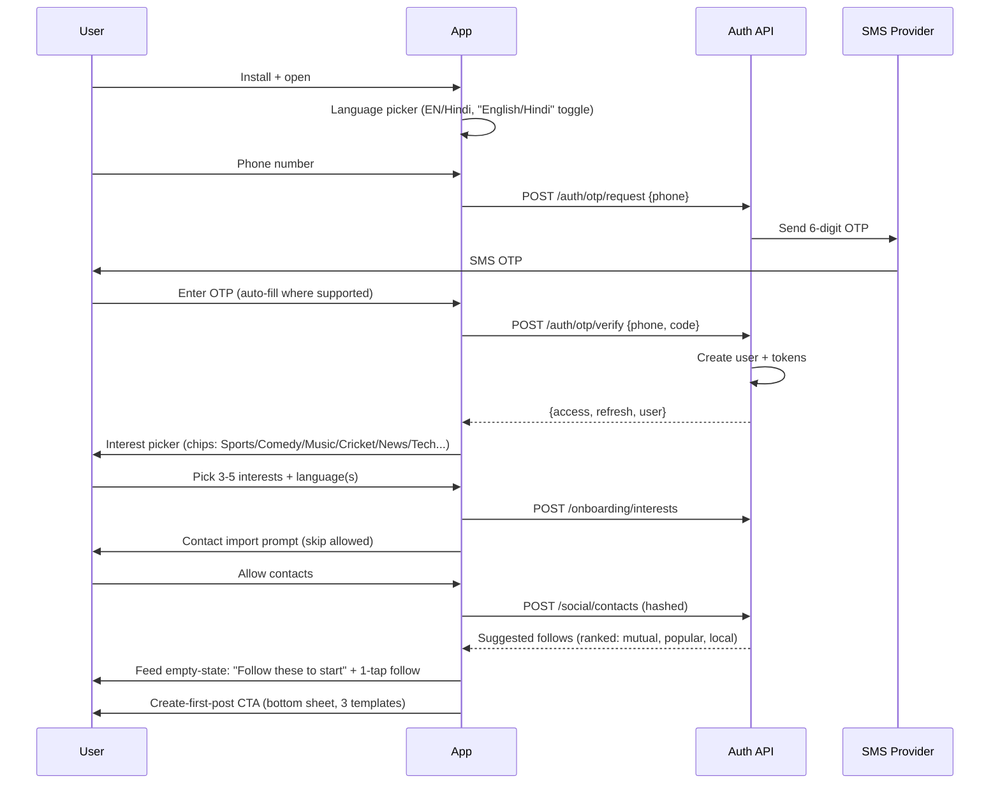
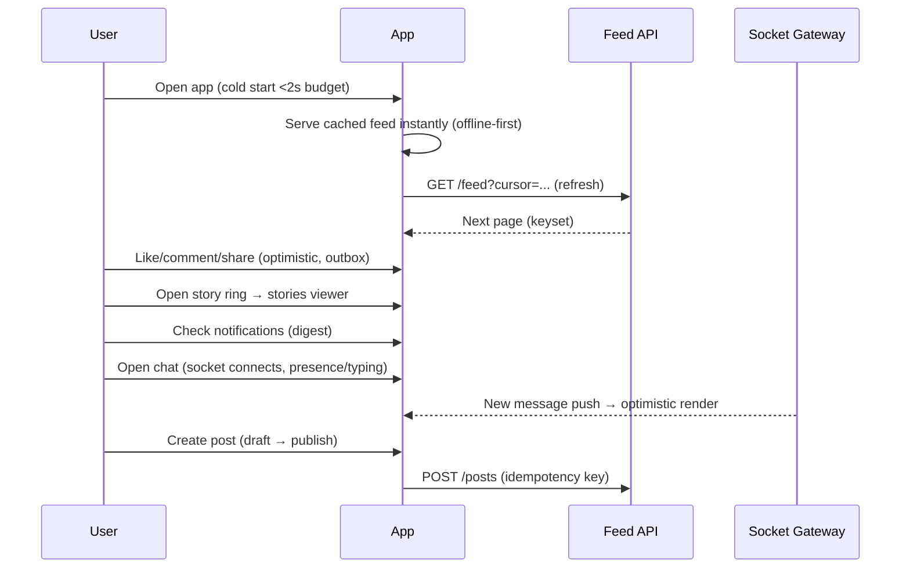
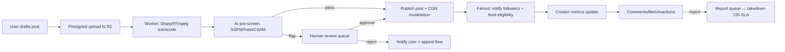

# Product Specification: "Instagram for Bharat"

**Date:** 2026-08-16
**Status:** Committed — MVP v0.1
**Companion:** `architecture-decision.md` (technical spec)
**Basis:** `india-social-app-arch.md` (Feynman research report)

---

## 1. Positioning & Thesis

### 1.1 The Product in One Line
A **vernacular-first, lightweight social network for India** — posts, stories, communities, and chat — that works on 2GB-RAM phones and slow networks, puts creators first, and feels local.

### 1.2 What We Are Not
- Not another TikTok clone chasing Gen Z English-first users.
- Not a feature-copy of Instagram.
- We are the network for the **hundreds of millions of Indian users Instagram doesn't serve well**: Tier 2/3 city users, regional-language creators, low-end device owners, price-sensitive data users, and small businesses who need local reach.

### 1.3 Why Instagram Loses In India (and why there's room)
| Instagram pain point (India) | Our answer |
|---|---|
| 70–120MB app, heavy on 2GB-RAM devices | **<50MB** APK, Android Go friendly, aggressive memory budget |
| Data-hungry (autoplay video, HD by default) | **Low-data mode**: quality caps, no autoplay, data-budget meter |
| Algorithm pushes global/English content | **Vernacular-first** discovery: language is a first-class filter |
| Weak regional-language depth and moderation | 11+ languages, regional moderation, local trend detection |
| Creator monetization gated (followers, region, country) | **No follower thresholds**, UPI payouts, small-creator economics |
| Commerce is bolt-on and global | Local-commerce-ready: shop posts, WhatsApp share-cards, local businesses |
| Toxicity/moderation gaps, privacy concerns | Strong blocks/mutes, transparent appeals, privacy controls |
| Communities are weak | **Rooms** (topic groups) as a first-class surface |

### 1.4 The Replacement Thesis (honest version)
We will **not** "replace Instagram" by out-featuring it. The realistic play:

1. **Win the underserved segment first** — vernacular users, low-end devices, regional creators. This is a segment Instagram structurally neglects, not a head-on war.
2. **Expand upward** — once regional networks, communities, and commerce are dense, English-first urban users join for *local relevance* (their city's creators, businesses, trends) — the one thing IG can't give them.
3. **Superposition/migration loops** (see §2) make switching cheap.

This mirrors how ShareChat/Moj won vernacular India without displacing Instagram for urban users — we add the modern product quality (stories, chat, clean UX) those platforms lacked.

---

## 2. Superposition & Migration Strategy (how users leave Instagram)

Each loop lowers switching cost:

1. **Contact import + smart suggestion** — onboard by importing contacts; immediately shows "people you know are here."
2. **WhatsApp share-cards** — every post/room/profile generates a rich share card (image + caption + link) for WhatsApp/telegram — the #1 sharing channel in India.
3. **SMS/WhatsApp invite loops** — "X invited you" + reward both sides (badge/streak) on first mutual follow.
4. **Cross-posting tool** — publish-to-Instagram button (opens IG share sheet with your post pre-loaded) so creators don't choose; they *add* us.
5. **IG archive import** — user can import posts via their IG data export (JSON) or link-paste; converts identity and content history.
6. **Offline-first reliability** — our feed, stories, and chat work on patchy 2G where IG degrades to a spinner. "Works where Instagram doesn't" is a literal ad line.
7. **Link-in-bio + URL shortener** — "myhandle.fm/handle" profile links usable in IG bios, funneling their existing audience to us.
8. **Local anchors** — city/neighborhood rooms and local-business profiles create reasons to open the app that Instagram can't match.

**North-star metric for migration:** *share-card installs per creator* and *imported-posts per new creator*.

---

## 3. Content Types (what we show)

### 3.1 MVP v0.1 — in scope
| Content | Description | Notes |
|---|---|---|
| **Posts** | Text + up to 10 images, or a single ≤60s clip, or text+image mix | The core surface. Markdown-lite (bold, mentions, hashtags) |
| **Stories** | Ephemeral 24h photo/video (≤60s per slide) | High-retention, cheap to build (TTL expiry only) |
| **Comments + replies** | Nested one level, emoji reactions | |
| **Reactions** | Like + configurable emoji set (😍🔥😂😢😡 + 👏) | Regional-emoji aware |
| **Follow graph** | Follow/unfollow, public/private profiles, blocked list | |
| **Rooms (communities)** | Topic/city/language groups with their own feed + members | First-class, not an afterthought |
| **Hashtags + trends** | Searchable, per-language trending lists | Regional trend detection |
| **Profiles** | Bio, avatar, cover, verified badge, links, highlights | |
| **Chat** | 1:1 + group DMs, typing, presence, read receipts | |
| **Notifications center** | In-app + push, digest mode | |

### 3.2 Deferred (explicitly NOT v0.1)
- Full-screen vertical video feed / For-You page (cohort decision gate — see §5.2)
- Live streaming, audio rooms
- AR filters, duets, remix/stitch
- Ads, subscriptions, virtual gifting, tips
- OpenSearch-backed search, ML personalization
- Voice/video calls
- Desktop/web-first clients
- Payments (schema is UPI-ready only)

### 3.3 Why this content set
- **Covers the undecided cohort question.** Text/image posts + ≤60s clips serve vernacular communities, Millennial rooms, AND Gen Z clip-sharing without committing to a heavy video-first pipeline.
- **Cheap to build solo.** No transcoding farms, no ML ranking, no live infra.
- **Retention levers are cheap.** Stories + Rooms + chat drive daily opens at near-zero algorithmic cost.

---

## 4. How We Deliver Content

### 4.1 Feed model: fanout-on-read hybrid
- **Home feed** = own posts + follows' posts (and chosen room posts), merged from a cached follow graph.
- Ranked by **recency + lightweight engagement score** (e.g., `score = age_decay × (likes+comments+shares)`) computed at read time.
- **Keyset-cursor pagination** (`WHERE (posted_at, id) < (cursor) ORDER BY posted_at DESC`) — stable, indexed, no OFFSET.
- **Explore tab** = global + language-filtered recency/engagement; no personalization ML in v0.1.
- Rationale: fanout-on-write (Instagram's approach) is the hardest scaling problem in the domain and unnecessary at our size. Read-time computation from a cached graph is correct for ≤ low millions of users and gives instant follow/unfollow semantics.

### 4.2 Media delivery
- Uploads go **direct-to-R2 via presigned URLs** (client → storage, API never proxies media).
- Worker pipeline: validate → virus/image-safety pre-screen → **Sharp** transcode images (WebP/AVIF, multi-resolution, progressive) → **FFmpeg** transcode clips (H.264 MP4 + optional HLS for >30s) → thumbnail/cover generation → publish.
- All media served from **Cloudflare CDN** with signed URLs; long TTLs + cache invalidation on publish.
- **Low-data mode**: quality caps per plan, autoplay off, "load images on Wi-Fi only" toggle, data-budget meter with warnings.

### 4.3 Offline-first
- Feed/stories/profiles cached on device (SQLite via `expo-sqlite` or MMKV + query layer).
- Like/comment/create go into an **outbox queue** → optimistic UI → sync on reconnect with idempotency keys (no double-posts).
- Readable-online-required for live chat history only (cached too, synced delta).

### 4.4 Real-time
- socket.io for presence, typing, new messages, live notification toasts.
- Push via FCM (Android) / APNs (iOS) through Expo Notifications, **digest strategy** (smart batching, user-controlled frequency).

---

## 5. MVP Scope

### 5.1 v0.1 In/Out table
| Area | In | Out |
|---|---|---|
| Auth | Phone OTP (primary), email/password, Google OAuth | — |
| Identity | Profile, avatar, cover, bio, verify badge, links, highlights | — |
| Content | Posts (text/images/clip), stories, comments, reactions | Live, AR, duets, audio rooms |
| Social | Follow, block, mute, rooms, hashtags, trends | — |
| Chat | 1:1 + group, typing/presence/receipts | Voice/video, e2ee (later) |
| Discovery | Home feed, explore, search (PG full-text) | ML personalization, OpenSearch |
| Notifications | In-app + push, digests | — |
| Moderation | AI pre-screen, report, block, appeals, grievance flow | Human review console (basic admin panel only) |
| i18n | **English + Hindi** | 9 more languages |
| Perf | <50MB APK, low-data mode, offline feed | — |
| Monetization | — (schema UPI-ready) | Ads, gifting, subscriptions, payments |
| Compliance | IT Rules 2021 baseline (reporting, grievance officer flow, transparency report stub) | Traceability (see risks) |

### 5.2 Decision gates
- **Gate G1 (post-launch, ~5k MAU):** cohort decision → if Gen Z video wins, add For-You vertical feed (M-series milestone).
- **Gate G2 (>500k MAU):** split feed + media out of the monolith; add OpenSearch; start ML ranking.
- **Gate G3 (>2M MAU):** Kafka eventing, dedicated chat service, regional CDN strategy, deep compliance automation.

---

## 6. End-to-End User Flows

### 6.1 Onboarding (target: 3 screens, <90 seconds)

### 6.2 Daily engagement loop

### 6.3 Content lifecycle (create → publish → moderate)

### 6.4 Error UX per flow (summary)
| Failure | User-facing behavior |
|---|---|
| OTP not received | Resend timer + "call me instead" (IVR) fallback |
| Slow network / timeout | Skeleton screens, retry with backoff, offline banner |
| Upload fails mid-way | Resume (chunked), queued retry, draft preserved |
| Post rejected | Clear reason + appeal button (72h SLA) |
| Message send fails | Red ! retry affordance, outbox holds it |
| 429 rate-limit | "Slow down" toast + cooldown indicator |
| Server 5xx | Generic error + requestId for support, auto-retry idempotent calls |

---

## 7. Success Metrics (v0.1)

- **Activation:** % new users posting within 24h (target >30%)
- **Retention:** D1 >45%, D7 >25%, D30 >12% (vernacular/social baselines)
- **Network:** contacts-connected %, mutual-follows per new user
- **Perf:** cold start <2s (p50), APK <50MB, feed p95 <150ms
- **Reliability:** error rate <1%, crash-free sessions >99.5%
- **Growth:** share-card install conversion >5%

---

## 8. Risks & Open Questions

1. **Cohort undecided** — mitigated by lightweight-media MVP (G1 gate).
2. **SMS costs** — OTP at scale is real money; Msg91 bulk + WhatsApp OTP fallback; re-authentication hardening to avoid SMS-bomb abuse.
3. **Vernacular moderation** — Hindi OK solo; 9 languages need regional reviewers (community-driven + partner orgs).
4. **Traceability (IT Rules)** — see compliance section in architecture doc; legal posture needed before >5M users.
5. **Creator payout law** — TDS/GST for creator earnings; defer with schema-ready design.
6. **Android Go store presence** — Play policy + device-testing matrix (Moto E, Redmi budget line, Samsung Go).
